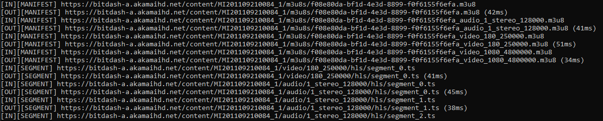

# C++ video proxy using Boost.Asio and Boost.Beast

## Content

- [Introduction](#introduction)
- [Requirements](#requirements)
- [How to build](#how-to-build)
- [How to use](#how-to-use)
- [How to launch unit tests](#how-to-launch-unit-tests)
- [Limitations](#limitations)

## Introduction

Proxy to log documents exchanged in a video stream between a player and a media server.



It works on HLS and MPEG-DASH formats when there is relative urls for segments in manifests. For absolute urls, it works only for HLS format.

Two example videos: 
 - https://bitdash-a.akamaihd.net/content/MI201109210084_1/m3u8s/f08e80da-bf1d-4e3d-8899-f0f6155f6efa.m3u8
  - https://bitmovin-a.akamaihd.net/content/MI201109210084_1/mpds/f08e80da-bf1d-4e3d-8899-f0f6155f6efa.mpd

## Requirements

- Conan >= 1.39 and < 2.0
- CMake 3.5.1 or later

## How to build

Create a subfolder in your project folder to generate build files:
```
cd <project_folder>
mkdir build
cd build
```

Retrieve depencencies with conan:
```
conan install .. --build=missing -s build_type=Release
```

Generate the project with cmake (Command for Visual Studio 2022):
```
cmake .. -G "Visual Studio 17 2022" -DCMAKE_TOOLCHAIN_FILE=conan_toolchain.cmake
```

Build:
```
cmake --build . --config Release
```

## How to use

video_proxy_server is a local server (running on localhost) taking 3 parameters:
- proxy server port
- media server protocol: http or https
- media server host: www.domain.net

```
video_proxy_server 8080 https bitdash-a.akamaihd.net
```
Now, the proxy is waiting for a request on specified port to stream any video available on given media server using the specified protocol.

In a media player like VLC, enter a Network URL combining the proxy host:port and the relative path of the video on origin media server

```
http://localhost:8080/content/MI201109210084_1/m3u8s/f08e80da-bf1d-4e3d-8899-f0f6155f6efa.m3u8
```

## How to launch unit tests

Execute video_proxy_test

## Limitations

- Localhost bound proxy 
- Media server bound execution: All files of the video have to be exposed by the same media server (unique host name)
- Media server protocol bound execution
- No SSL certificate check
- Logs are only printed in the standard output


